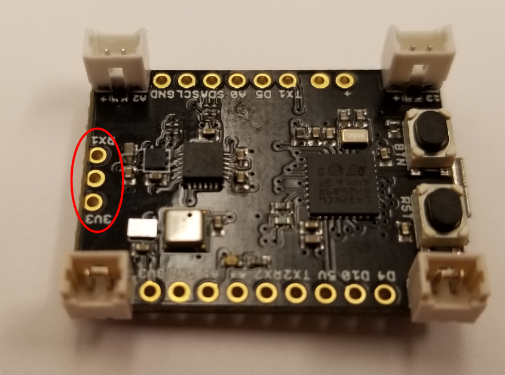
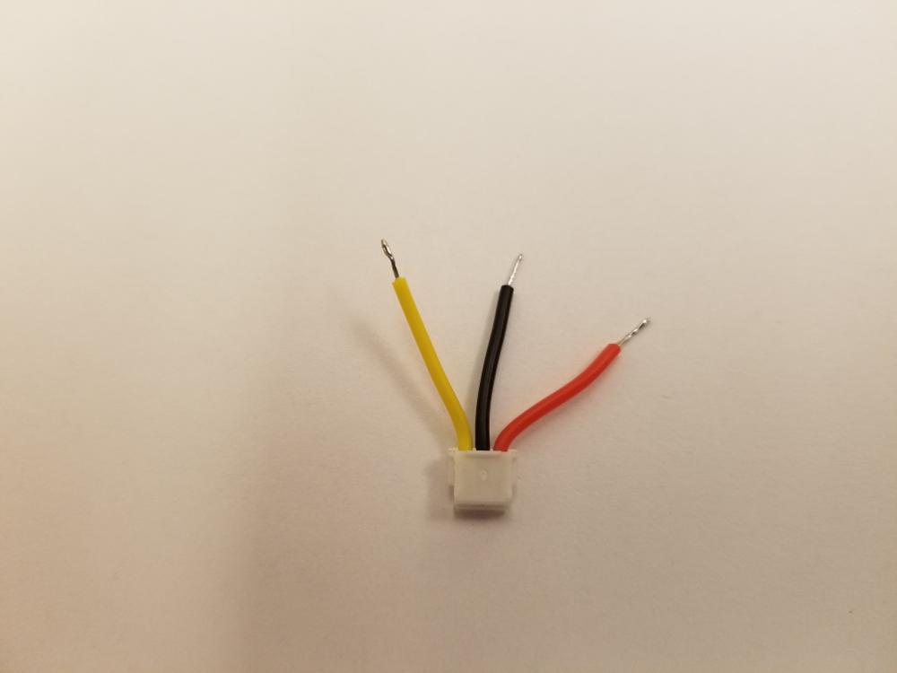
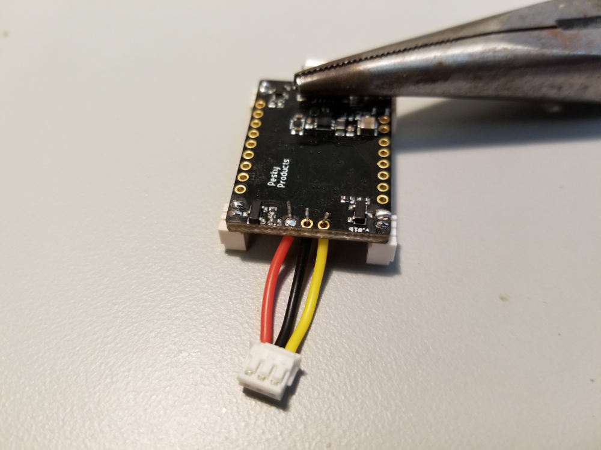
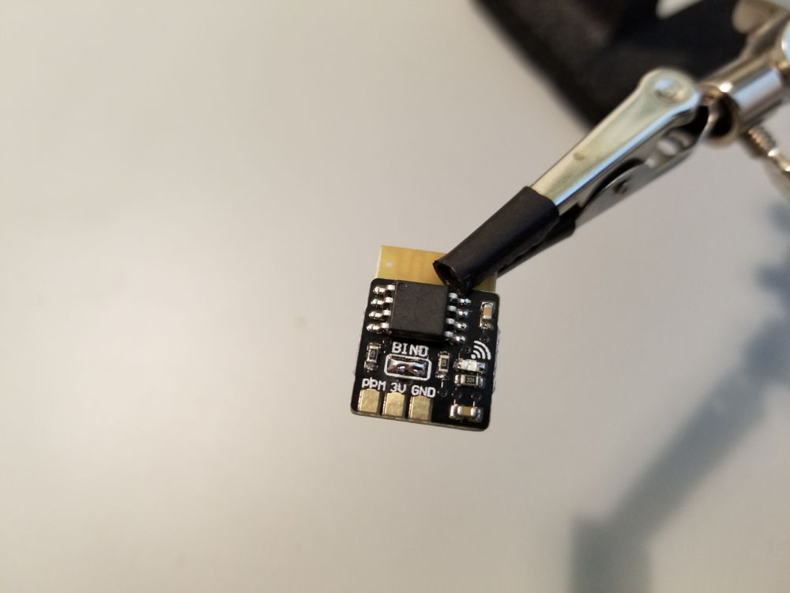
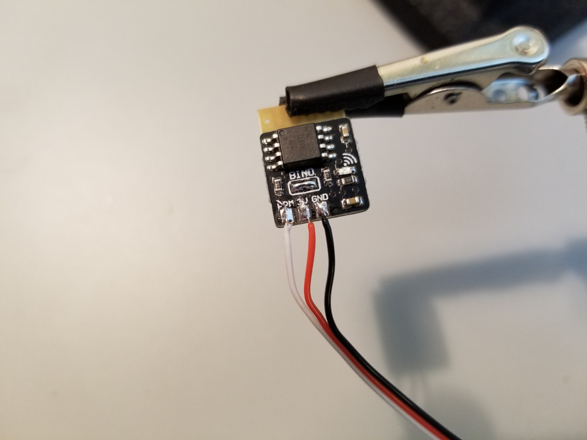

As we described [earlier](https://github.com/simondlevy/Hackflight/wiki/B.-Choosing-a-receiver), 
the LadybugFC has a dedicated set of pins for connecting to a DSMX, SBUS, or CPPM receiver:

Now we will show how to connect your receiver to the LadybugFC and test the connection before
your first flight.

## DSMX

For a DSMX receiver like the [Lemon RX DSMX Satellite
Receiver](https://www.amazon.com/gp/product/B00SUM3H6O/ref=oh_aui_search_detailpage?ie=UTF8&psc=1),
you will first need to bind the satellite receiver to your transmitter.  Here you have three choices:

* Use a five-volt Arduino (Uno, Mega) and the 
[BindSpektrum](https://github.com/simondlevy/SpektrumDSM/tree/master/examples/BindSpektrum) 
sketch from the examples in our SpektrumDSM library.
* Use the main receiver, as shown in [this video](https://www.youtube.com/watch?v=28o6O9QUiAI).
* Use Cleanflight with an ordinary flight controller, as shown in 
[this video](https://www.youtube.com/watch?v=JPOvgha9b4w).

Once you've bound your DSMX receiver to your transmitter, you can wire the receiver to the LadybugRC. 
Although you could use the cable that comes with the receiver, we prefer 
[these](https://micro-motor-warehouse.com/collections/flight-controllers/products/alien-receiver-cable)
awesome little cables, whose color coding helps you avoiding connecting the cable to the wrong pins.

Snip off the plastic connector on one end of the cable (it doesn't matter which end), and pinch off
3-4mm of insulation from the ends of the wires.  Twist the strands on each wire as tight as you can, and
[tin](https://www.thespruce.com/tinning-stranded-electrical-wires-1152893) each one carefully, making sure
not to add so much solder that the wire won't pass through the hole:

 

Now you can pass the wires through the holes in the board top-to-bottom, turn the board over, and solder
them to the pads.  You can use the tip of a needle-nose pliers to keep the board in place while you
solder:

 

## SBUS

Wiring the FrSky XM SBUS micro receiver to the LadybugFC is straightforward: take a short length of wire for
power, ground, and signal, pinch off the insulation at both ends, tin the ends, pass them through the holes
in the LadybugFC and receiver, solder the connection firmly, and clip off any protruding soldered wire.
As the picture below (taken from a completed build) shows, the only possible &ldquo;gotcha&rdquo; is that the order
of the wires on the LadybugFC is <b>power</b>, <b>ground</b>, <b>signal</b>, whereas the order on the FrSky XM is 
<b>signal</b>, <b>power</b>, <b>ground</b>.  So you'll have to cross a pair of wires over each other to make the
right connections.

 

To bind the receiver to your Taranis transmitter, plug the LadybugFC into a powered USB cable,
turn on the the Taranis, and follow the bind procedure shown in this 
[video](https://www.youtube.com/watch?v=ZOBwwNpjNrY).  Although the power
specification for this receiver is 3.5 - 10V, we've found that the 3.3V
provided by the LadybugFC provides a clean signal (no dropped frames) with good
range.

## CPPM

<b>Once more, please note that because of the decreasing popularity of CPPM receivers, we have not
been able to maintain and test Hackflight with this kind of receiver.</b>

Many modern CPPM receivers have a bind button you can hold down during power-up.  The FrSky Micro RX has a pair
of pads on which you deliberately solder a bridge to put the receiver in bind mode:

 

Taking the wires that came with the receiver, strip off a little insulation at the end by pinching, tin the
exposed braid, and solder the tinned ends to the receiver:

 

Then you can strip, tin, and solder the other end of the wires to the receiver as in the image for the
DSMX receiver [above](https://raw.githubusercontent.com/wiki/simondlevy/Hackflight/images/rxsoldering.png).

To bind the receiver to your Taranis transmitter, plug the LadybugFC into a powered USB cable,
turn on the the Taranis, and follow the bind procedure shown in this 
[video](https://www.youtube.com/watch?v=IsVKLb29Xo8#t=01m36s).  (The receiver in the video is different,
but the process is identical).  After binding, desolder the bridge on the receiver 
(a 
[solder sucker](https://www.amazon.com/gp/product/B003FHYL7I/ref=oh_aui_search_detailpage?ie=UTF8&psc=1)
is your safest bet).

<b>Next</b>: [Testing with Hackflight GCS](https://github.com/simondlevy/Hackflight/wiki/L.07-Testing-with-GCS)
