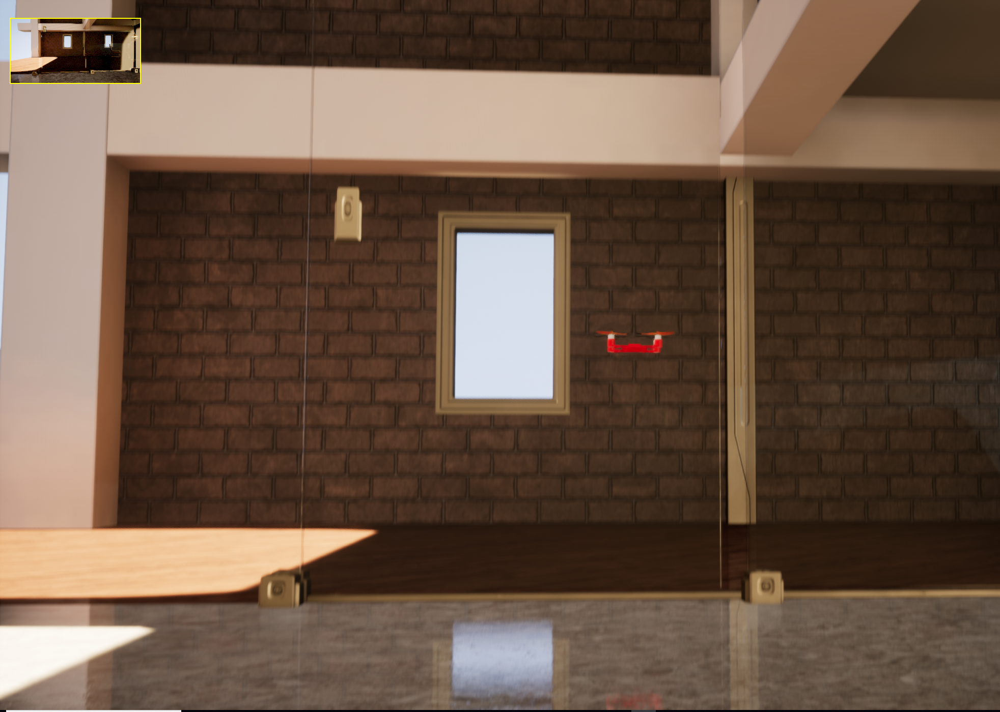

<a href="https://www.youtube.com/watch?v=mobemDcX9ew"></a>

# About

MulticopterSim is a simple multicopter flight simulator using Unreal Engine 4.  It runs on Windows and Linux.

I began this project using the [V-REP platform](https://github.com/simondlevy/Hackflight-VREP) but switched to UnrealEngine after seeing the kinds of beautiful, real-time simulations that Microsoft was able to get with its [AirSim](https://github.com/Microsoft/AirSim) program. 

MulticopterSim differs from AirSim in a few important ways:
* MulticopterSim can be used with the same simple flight-control [firmware](https://github.com/simondlevy/Hackflight/tree/master/src) that we fly on our real-world [quadcopters](http://diydrones.com/profiles/blogs/flight-of-the-ladybug).
* MulticopterSim is tiny, under 2,000 lines of code.
* MulticopterSim focuses exclusively on multirotor firmware, whereas AirSim supports deep learning and different kinds of vehicles.

# Prerequisites

## Hardware

I am currently developing MulticopterSim on an HP Z440 workstation with 32GB RAM and NVIDIA GeForce GTX 1080 Ti. It may however be  possible to develop on a less &ldquo;loaded&rdquo; machine &ndash; see [here](https://docs.unrealengine.com/latest/INT/GettingStarted/RecommendedSpecifications/) for the minimum requirements recommended by Unreal Engine.

For a realistic flying experience, you will also likely want some sort of game controller or R/C transmitter.  MulticopterSim currently supports the following controllers through the [Joystick](https://github.com/simondlevy/MulticopterSim/blob/master/Source/FlightModule/joystick/Joystick.h) class:

* PS4 controller
* XBox One controller
* XBox 360 controller
* XBox 360 controller clone
* PS3 controller clone
* Logitech Extreme Pro 3D joystick
* Logitech F310 gamepad
* FrSky Taranis TX9 RC transmitter with mini USB cable 
* Spektrum transmitter with WS1000 wireless simulator dongle
* Great Planes RealFlight Interlink

## Toolchain

You will need Unreal Engine 4.26.2 (UE4). To install UE4, follow these [instructions](https://docs.unrealengine.com/en-US/GettingStarted/Installation/index.html).

# Build

Although MulticopterSim is designed to work with any flight-control software you like, it easiest to get started with the [Hackflight](https://github.com/simondlevy/Hackflight) software. So to get started, you should do the following:

1. Clone this repostitory (MulticopterSim) into your <b>Documents/Unreal Projects</b> folder, first creating that folder if it doesn't exist.
   
2. Clone the [Hackflight](https://github.com/simondlevy/Hackflight) repository into your <b>Documents/Arduino/libraries</b> folder, first creating that folder if it doesn't already exist.  (You don't need to install Arduino; this is simply where MulticopterSim looks for the Hackflight software.)

3. Follow the next steps to complete the build on your OS.

## Windows

1. Right-click on the <b>MulticopterSim.uproject</b> file and select <b>Generate Visual Studio project file</b> to generate a <b>.sln</b> file

2. Double-click on the resulting <b>MulticopterSim.sln</b> file to launch VisualStudio.  The first time you do this, you may have to wait a few minutes while Visual Studio parses up all of the UE4 files needed to build the project.

3. In Visual Studio, edit the file [MulticopterSim/Source/FlightModule/FlightModule.Build.cs] to reflect where you installed Hackflight.

4. In VisualStudio, hit the F5 key to build the project and launch UnrealEditor.

## Linux

1. Edit the file [MulticopterSim/Source/FlightModule/FlightModule.Build.cs] to reflect where you installed Hackflight.

2. Then:
```
% cd ~/Documents/Unreal\ Projects/MulticopterSim/
% ./build.sh
% ./run.sh
```

# Launch and fly!

In UnrealEditor, select one of the maps in <b>Content/Flying/Maps</b>. Then in <b>Content/C++ Classes</b>, open the <b>FlightModule</b> folder and drag the vehicle pawn into the map. Click the play button and you're ready to begin. You can use the  1,2,3 keys to switch your point-of-view.

