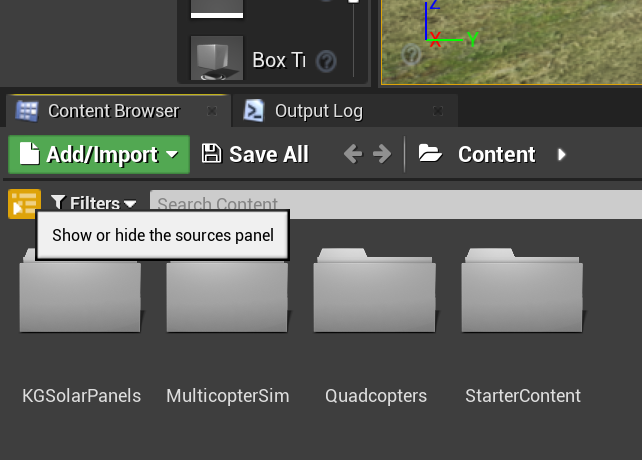

# Ladybug Build

## Required Software

1. Arduino IDE

## Building the Ladybug

You need to place the following files in these respective directories (or equivalent ones):

1. The Hackflight_new, CPPMRX, CrossPlatformDataBus, and USFS folders into the Arduino libraries directory. (On Windows this is found in Documents/Arduino/libraries)
2. The grumpyoldpizza folder into the Arduino hardware directory. (On Windows this is found in Documents/Arduino/hardware)

Follow the instructions in Hackflight_new/docs/L.00-Arduino-Setup.md to install the required hardware libraries and learn how to flash the Arduino sketch to the Ladybug microcontroller.

The file that you need to flash is Syma/Syma.ino. This file has been configured for the following hardware configuration:

1. The drone from the following link with some changes highlighted below <https://diydrones.com/profiles/blogs/flight-of-the-ladybug>
2. The CPPM receiver from the link <https://hobbyking.com/en_us/orangerx-r615x-dsm2-dsmx-compatible-6ch-2-4ghz-receiver-w-cppm.html?___store=en_us>

Read the file NeRTA Implementation to learn how the NeRTA algorithm has been implemented.

# Simulator Build

## Required software

1. Unreal Engine 4.26.2
2. Visual Studio 2022 with the following components:
    2a. MSVC v143 - VS 2022 C++ x64/x86 build tools (Latest)
    2b. Windows 10 or 11 SDK
    2c. .NET Framework 4.8 SDK

## Required hardware

1. Game controller (Used an Xbox 360 controller) unless in scripted mode

## Building the simulator

Place the MulticopterSim folder into the Unreal Projects directory (On Windows this is found in Documents/Unreal Projects, and the Hackflight_new folder into the Arduino libraries directory. (On Windows this is found in Documents/Arduino/libraries).

Follow the instructions in the README.md inside MulticopterSim to build the simulator.
Make sure to change the ARDUINO_PATH variable in [MulticopterSim/Source/FlightModule/FlightModule.Build.cs] to the directory where you have placed the Hackflight_new folder in.

Once the simulator is built (using Visual Studio), open the MulticopterSim.uproject file using Unreal Engine.

Click the "Show or hide the sources panel" button to show the sources panel.

Click on "C++ Classes" in the sources panel and then click on "HackflightModule" and "pawns". You should see PhantomPawn. Drag it onto the scene and run the simulator.

Read the file Simulator Implementation.md to learn how to use the simulator.
